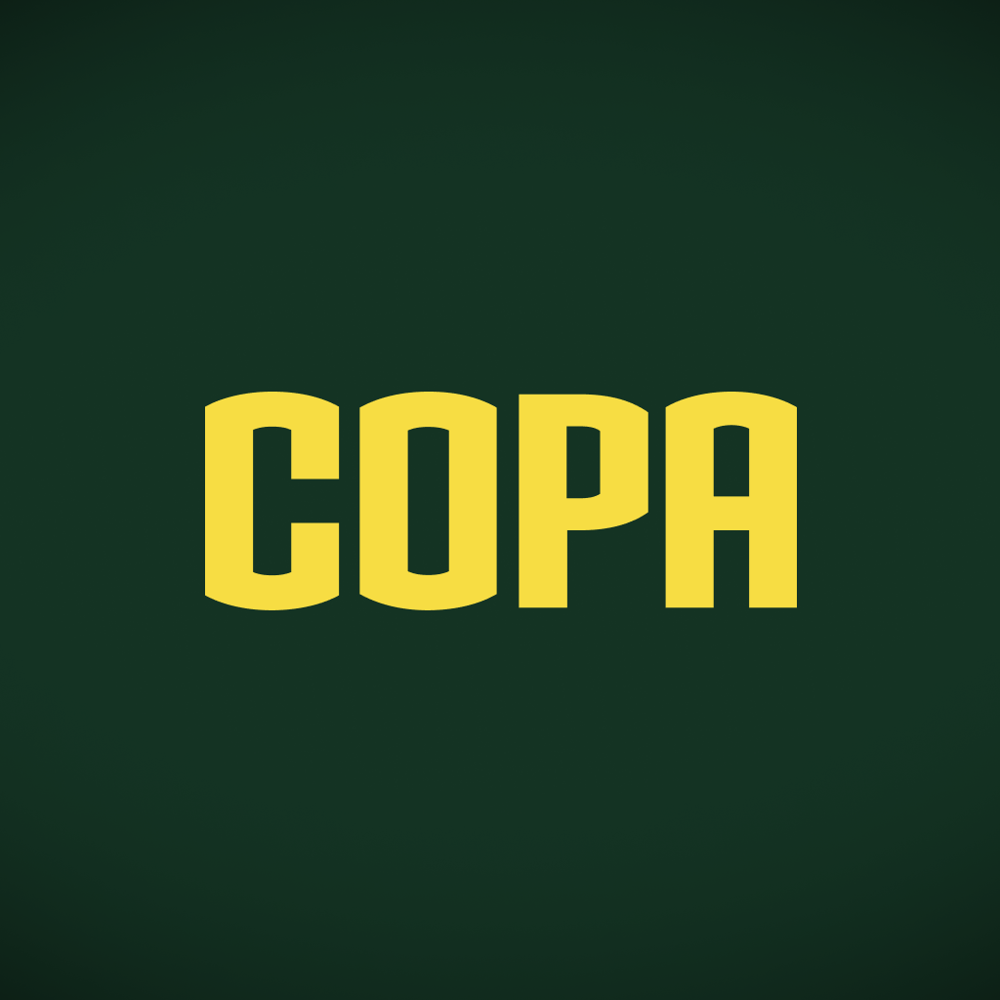

  

  
  

## 💻 Project

Soccer World Cup Fifa 2022 polls mobile app. 

## ✨ Technologies

- [TypeScript](https://www.typescriptlang.org/)
- [React](https://reactjs.org/)
- [React Native](https://reactnative.dev/)
- [Expo](https://expo.dev/)
- [Fastify](https://www.fastify.io/)
- [Prisma](https://www.prisma.io/)
- And some others…

## 🚀 How to setup

After access the project folder, install the packages using your preferred package manager. (See package.json files)

Link to projects:

- [Backend](./server/README.md)
- [Mobile](./mobile/README.md)

## 📝 License

Esse projeto está sob a licença MIT. Veja o arquivo [LICENSE](LICENSE) para mais detalhes.

---
